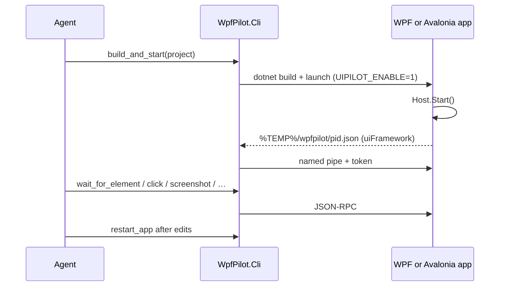

# Overview

WpfPilot lets an AI coding agent drive and inspect a running desktop UI app from the inside.
The same MCP tools and named-pipe protocol (**v1.1**) work for **WPF** (`WpfPilot`) and
**Avalonia** (`AvaloniaPilot`).

## Why in-process

External UI Automation sees the accessibility projection of your app. It cannot tell you *why*
a binding failed, what the DataContext is, or that an element rendered with zero size. The
in-process library has the live objects: visual tree, binding errors, layout, and
`RenderTargetBitmap` screenshots even when minimized/occluded.

## The pieces

| Package | Role |
|---|---|
| `WpfPilot.Core` | Protocol, discovery, pipe, `IUiBackend`, `ToolCatalog`, `PilotRuntime` |
| `WpfPilot` | WPF adapter + `WpfPilotHost.Start()` |
| `AvaloniaPilot` | Avalonia adapter + `AvaloniaPilotHost.Start()` |
| `WpfPilot.Cli` | stdio MCP bridge + build/launch/restart loop |

## Agent edit loop

## Try it

- [03-adoption.md](03-adoption.md) — one-line wiring
- [05-tools.md](05-tools.md) — full MCP tool catalog
- [samples/SampleApp](../samples/SampleApp) / [samples/AvaloniaSampleApp](../samples/AvaloniaSampleApp)
