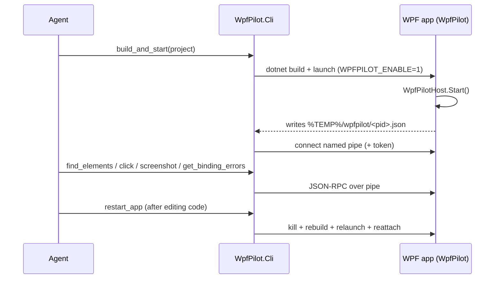

# Overview

WpfPilot lets an AI coding agent drive and inspect a running WPF app from the inside.

## Why in-process

External UI Automation (FlaUI, UIA) sees the accessibility projection of your app. It cannot
tell you *why* a binding failed, what the DataContext is, or that an element rendered with zero
size. WpfPilot runs inside your process, so it has the live objects: the visual tree, binding
errors, layout, and the ability to render any window to a bitmap even when it is occluded.

## The two pieces

1. **`WpfPilot`** - a NuGet library you reference in your app. You call `WpfPilotHost.Start()`
   once. It stands up a named-pipe server exposing built-in tools. See
   [src/WpfPilot](../src/WpfPilot).
2. **`WpfPilot.Cli`** - a standalone tool your agent runs as an MCP server (over stdio). It
   discovers running apps, bridges MCP tool calls to the app's pipe, and owns the build/launch/
   restart loop. See [src/WpfPilot.Cli](../src/WpfPilot.Cli).

## The agent edit loop

## Try it

See [03-adoption.md](03-adoption.md) to wire it into your own app, and the root
[README](../README.md) plus [samples/SampleApp](../samples/SampleApp) for a runnable example.
