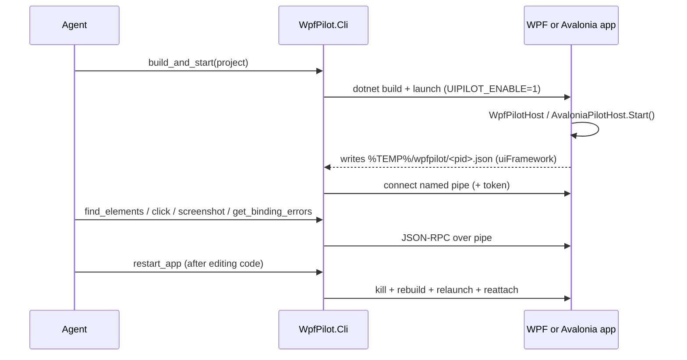

# Overview

WpfPilot lets an AI coding agent drive and inspect a running desktop UI app from the inside.
The same MCP tools and named-pipe protocol work for **WPF** (`WpfPilot`) and **Avalonia**
(`AvaloniaPilot`).

## Why in-process

External UI Automation (FlaUI, UIA) sees the accessibility projection of your app. It cannot
tell you *why* a binding failed, what the DataContext is, or that an element rendered with zero
size. The in-process library has the live objects: the visual tree, binding errors, layout, and
the ability to render any window to a bitmap even when it is occluded.

## The pieces

1. **`WpfPilot.Core`** - shared protocol, discovery, pipe server, tool registry, and
   `IUiBackend` abstraction. See [src/WpfPilot.Core](../src/WpfPilot.Core).
2. **`WpfPilot`** - WPF backend + `WpfPilotHost.Start()`. See [src/WpfPilot](../src/WpfPilot).
3. **`AvaloniaPilot`** - Avalonia backend + `AvaloniaPilotHost.Start()`. See
   [src/AvaloniaPilot](../src/AvaloniaPilot).
4. **`WpfPilot.Cli`** - standalone MCP server (stdio). Discovers running apps, bridges MCP tool
   calls to the app's pipe, and owns the build/launch/restart loop. Framework-agnostic.

## The agent edit loop

## Try it

See [03-adoption.md](03-adoption.md) to wire it into your own app, and the root
[README](../README.md) plus [samples/SampleApp](../samples/SampleApp) /
[samples/AvaloniaSampleApp](../samples/AvaloniaSampleApp) for runnable examples.
