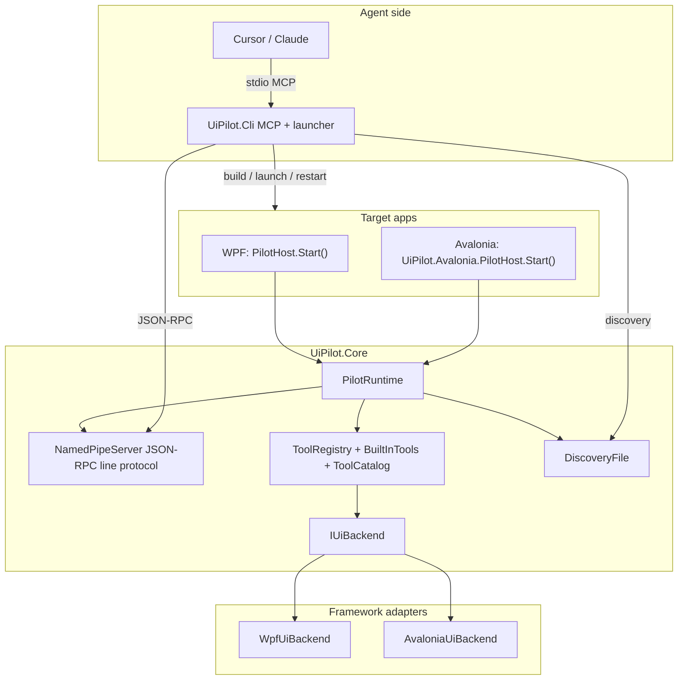

# Architecture

## Core (`src/UiPilot.Core`)

| Piece | Role |
|---|---|
| `PilotRuntime` | Enablement, pipe, discovery, tool wiring; idempotent host start |
| `IUiBackend` / `FindPage` | Framework-neutral automation contract |
| `ToolCatalog` | Canonical built-in tool names (CLI + tests parity) |
| `PilotToolException` | Structured `error.data` codes for agents |
| `Server/*` | Named pipe, JSON-RPC, discovery, Low-IL pipe security |
| `BuiltInTools` | Identical tool surface for every adapter |

UI work marshals through `ToolContext.OnUi` (WPF `Dispatcher` / Avalonia `Dispatcher.UIThread`).
Real-input `drag` runs off the UI thread under its own lock.

## Adapters

- **WPF** — visual/logical tree, UIA peers, binding trace, adorners, DPI-aware screenshots.
- **Avalonia** — split under `Inspection/` + `Interaction/` + `Media/`; chained log sink for binding capture.

## CLI

- References Core (shared `DiscoveryInfo`).
- Forwards every `ToolCatalog` tool; extras: `describe_app_tools`, `invoke_app_tool`.
- Screenshot → MCP image content + path metadata.
- Lifecycle: attach filters, `detach`, structured error JSON.
