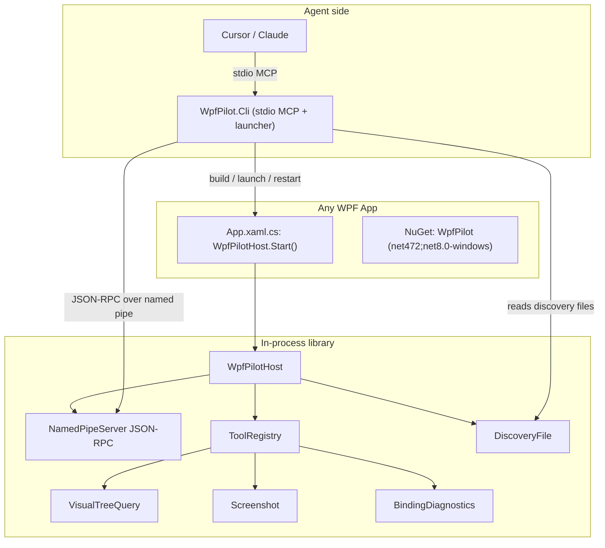

# Architecture

## In-process library (`src/WpfPilot`)

| Component | File | Role |
|---|---|---|
| Entry point | [WpfPilotHost.cs](../src/WpfPilot/WpfPilotHost.cs) | `Start()`/`Stop()`, enablement gate, wiring. |
| Options | [WpfPilotOptions.cs](../src/WpfPilot/WpfPilotOptions.cs) | Force, pipe name, token, discovery dir. |
| Pipe server | [Server/NamedPipeServer.cs](../src/WpfPilot/Server/NamedPipeServer.cs) | Accept loop, token auth, dispatch. |
| RPC envelope | [Server/JsonRpc.cs](../src/WpfPilot/Server/JsonRpc.cs) | Request parse + result/error framing. |
| Discovery | [Server/DiscoveryFile.cs](../src/WpfPilot/Server/DiscoveryFile.cs) | Writes `%TEMP%/wpfpilot/<pid>.json`. |
| Tool registry | [Tools/ToolRegistry.cs](../src/WpfPilot/Tools/ToolRegistry.cs) | Name -> handler map, `describe`. |
| Built-in tools | [Tools/BuiltInTools.cs](../src/WpfPilot/Tools/BuiltInTools.cs) | The ~10 v1 tools. |
| Tree query | [Inspection/VisualTreeQuery.cs](../src/WpfPilot/Inspection/VisualTreeQuery.cs) | list/find/inspect. |
| Element handles | [Inspection/ElementRegistry.cs](../src/WpfPilot/Inspection/ElementRegistry.cs) | Weakly-held stable ids. |
| Binding errors | [Inspection/BindingDiagnostics.cs](../src/WpfPilot/Inspection/BindingDiagnostics.cs) | Trace listener ring buffer. |
| Layout | [Inspection/LayoutAnalyzer.cs](../src/WpfPilot/Inspection/LayoutAnalyzer.cs) | Zero-size / off-screen. |
| Input | [Interaction/SyntheticInput.cs](../src/WpfPilot/Interaction/SyntheticInput.cs) | click/type/invoke. |
| Highlight | [Interaction/HighlightOverlay.cs](../src/WpfPilot/Interaction/HighlightOverlay.cs) | Adorner overlay. |
| Screenshot | [Media/Screenshot.cs](../src/WpfPilot/Media/Screenshot.cs) | `RenderTargetBitmap` -> PNG. |

### Threading

The pipe accept loop runs on a background thread. Every tool that touches WPF objects is
marshaled onto the app's `Dispatcher` via `ToolContext.OnUi(...)`
([Tools/ToolContext.cs](../src/WpfPilot/Tools/ToolContext.cs)). Element handles are weak
references, so holding an id never keeps the tree alive.

## CLI (`src/WpfPilot.Cli`)

| Component | File | Role |
|---|---|---|
| Host | [Program.cs](../src/WpfPilot.Cli/Program.cs) | stdio MCP server; logs to stderr only. |
| Connection state | [ConnectionManager.cs](../src/WpfPilot.Cli/ConnectionManager.cs) | Attach, send, build/restart. |
| Pipe client | [Pipe/PipeClient.cs](../src/WpfPilot.Cli/Pipe/PipeClient.cs) | Client end of the line protocol. |
| Discovery | [Discovery/DiscoveryReader.cs](../src/WpfPilot.Cli/Discovery/DiscoveryReader.cs) | Reads + validates pid liveness. |
| Launcher | [Process/AppLauncher.cs](../src/WpfPilot.Cli/Process/AppLauncher.cs) | `dotnet build` + start, kill tree. |
| Forwarding tools | [Tools/ForwardingTools.cs](../src/WpfPilot.Cli/Tools/ForwardingTools.cs) | MCP tools -> pipe. |
| Lifecycle tools | [Tools/LifecycleTools.cs](../src/WpfPilot.Cli/Tools/LifecycleTools.cs) | list/attach/build/restart/stop. |

The CLI never inherits stdout to child processes; build output is captured so it cannot corrupt
the MCP protocol stream.
