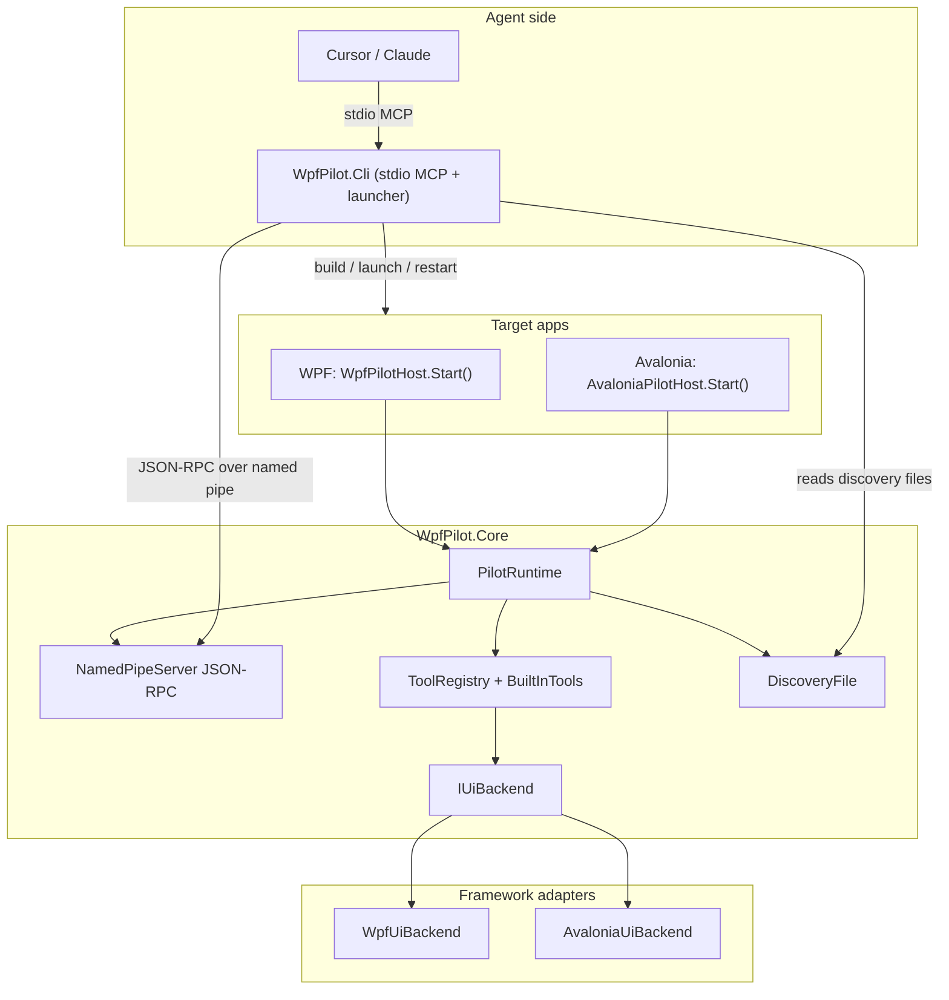

# Architecture

## Shared core (`src/WpfPilot.Core`)

| Component | Role |
|---|---|
| `Hosting/PilotRuntime` | Start/stop, enablement gate, wiring pipe + discovery + tools. |
| `PilotOptions` / `UiFrameworks` | Shared options + `wpf` / `avalonia` labels. |
| `Abstraction/IUiBackend` | Framework-neutral automation contract used by built-in tools. |
| `Server/*` | Named pipe, JSON-RPC, discovery file, pipe integrity (Windows). |
| `Tools/*` | `ToolRegistry`, `ToolContext`, `BuiltInTools` (identical tool names for every backend). |
| `Inspection/ElementInfo`, `ElementRegistry` | Agent-facing DTOs + weak handles (`object`). |
| `Interaction/RealInput` | OS SendInput drag (Windows). |

### Threading

The pipe accept loop runs on a background thread. Every tool that touches UI objects is
marshaled onto the app UI thread via `ToolContext.OnUi(...)`, which each host supplies
(WPF `Dispatcher` or Avalonia `Dispatcher.UIThread`).

## WPF adapter (`src/WpfPilot`)

`WpfPilotHost` + `WpfUiBackend` wrap the existing WPF visual-tree, UIA, binding-trace,
adorner, and `RenderTargetBitmap` implementations. Public API stays `WpfPilotHost.Start()`.

## Avalonia adapter (`src/AvaloniaPilot`)

`AvaloniaPilotHost` + `AvaloniaUiBackend` implement the same `IUiBackend` surface using Avalonia
visual/logical trees, control events/commands, logging-sink binding capture, and Avalonia
`RenderTargetBitmap`.

## CLI (`src/WpfPilot.Cli`)

Unchanged role: MCP bridge + lifecycle. Discovery now surfaces `uiFramework`. Launch sets both
`UIPILOT_ENABLE` / `WPFPILOT_ENABLE` (and the start-minimized pair) so either host enables.
