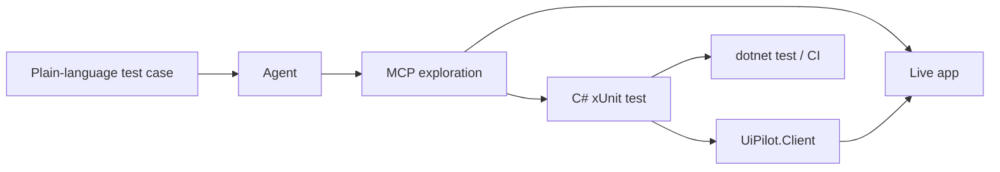

# C# regression tests

UiPilot uses two complementary surfaces with the same command vocabulary:

- **MCP** for an agent to explore and prove a flow against a live app.
- **`UiPilot.Client`** for the agent to freeze that proven flow as deterministic C#.

No model participates when the saved test runs. Product-specific tests live in the product
repository and reference `UiPilot.Client`; UiPilot itself contains only generic client and sample
code.



## Workflow

1. Give the agent a test case in plain language.
2. The agent uses `start_app`, `find_elements`, `click`, `type_text`, `screenshot`, and other MCP
   tools to discover stable element identities and verify the flow.
3. The agent writes a C# test using the matching `UiPilotClient` methods and asserts on their typed
   responses.
4. Run the saved test later with `dotnet test`; it executes without an agent.

MCP is the exploration surface. C# is the durable regression artifact.

Step 2 is mandatory and is done **one test step at a time**: run the MCP call, confirm it did what
the test case describes, and record the equivalent `UiPilotClient` call before moving on. The
recorded notes become the test body. Writing the whole test first and debugging it through
`dotnet test` is slower and hides which step is wrong, because every attempt pays full app startup.

A useful note per step captures the query, whether it needed `exact`, the matched element `type`,
and the interaction `method` that came back:

| Test step | Proven MCP call | C# | Observed |
|---|---|---|---|
| open Alarms | `find_elements(query: "Alarms", exact: true)` then `click(id)` | `FindElementsAsync` + `ClickAsync` | matched `SalienceNavigationButton`; a `TextBlock` also matches and cannot be clicked |

## Example

After proving the sample flow interactively, save it as:

```csharp
using UiPilot.Client;
using Xunit;

public sealed class GreetTests
{
    [Fact]
    public async Task Greets_by_name()
    {
        await using var pilot = new UiPilotClient();
        await pilot.StartAppAsync(sampleExe, session: "sample");

        var nameBox = (await pilot.WaitForElementAsync(
            "NameBox", exact: true, session: "sample")).Single();

        var typed = await pilot.TypeTextAsync(
            nameBox.Id, "UiPilot", session: "sample");
        Assert.Equal("synthetic:textbox-set", typed.Method);

        var greet = (await pilot.WaitForElementAsync(
            "GreetButton", exact: true, session: "sample")).Single();
        await pilot.ClickAsync(greet.Id, session: "sample");

        var greeting = await pilot.WaitForElementAsync(
            "Hello, UiPilot!", exact: true, session: "sample");
        Assert.Contains(greeting.Elements,
            element => element.Visible && element.Text == "Hello, UiPilot!");
    }
}
```

The important difference from the old YAML runner is that every command returns a response:

- element queries return ids, types, names, text, bounds, enabled/visible state, and pagination;
- interactions return the backend method used (`synthetic:button-command`,
  `synthetic:setpassword`, etc.);
- screenshots return PNG bytes and dimensions;
- lifecycle calls return session/process information;
- custom app tools can return product-owned DTOs through `InvokeAppToolAsync<T>`.

## API map

The C# names intentionally mirror MCP rather than introducing another test DSL.

| MCP command | C# method | Response |
|---|---|---|
| `start_app` | `StartAppAsync` | `SessionSnapshot` |
| `start_process` | `StartProcessAsync` | `SessionSnapshot` |
| `wait_for_log` | `WaitForLogAsync` | `LogWaitResult` |
| `find_elements` | `FindElementsAsync` | `ElementPageResult` |
| `wait_for_element` | `WaitForElementAsync` | `ElementPageResult` |
| `inspect_element` | `InspectElementAsync` | `ElementResult` |
| `find_ancestor` | `FindAncestorAsync` | `ElementResult` |
| `click` | `ClickAsync` | `InteractionResult` |
| `type_text` | `TypeTextAsync` | `InteractionResult` |
| `screenshot` | `ScreenshotAsync` | `ScreenshotResult` |
| custom app tool | `InvokeAppToolAsync<T>` | product-owned `T` |

`UiPilotClient` also exposes the remaining built-in MCP operations: windows, drag, keys, scroll,
focus, selection, commands, window state, binding errors, layout analysis, and highlighting.

Repository coverage includes both Avalonia and WinForms sample flows. The WinForms regression
test also exercises `Control.Name` selectors, ComboBox selection, MenuStrip navigation, resize,
and screenshots in normal and minimized states.

## Assertions, retries, and reusable flows

Use the product's normal test framework. UiPilot does not define `expect_visible` or
`click_until_visible` commands:

```csharp
var result = await pilot.FindElementsAsync(
    "Ready", exact: true, session: "client");
Assert.Single(result.Elements.Where(element => element.Visible));
```

Use normal C# methods for reusable product flows:

```csharp
private static async Task LoginAsync(
    UiPilotClient pilot, string user, string password)
{
    var userBox = (await pilot.WaitForElementAsync(
        "UserName", exact: true, session: "client")).Single();
    await pilot.TypeTextAsync(userBox.Id, user, session: "client");

    var passwordBox = (await pilot.WaitForElementAsync(
        "Password", exact: true, session: "client")).Single();
    var typed = await pilot.TypeTextAsync(
        passwordBox.Id, password, session: "client");
    Assert.Equal("synthetic:setpassword", typed.Method);
}
```

That helper belongs in the product test project because its selectors and behavior are
product-specific.

## Lifecycle

`UiPilotClient` stops all sessions it launched when disposed:

```csharp
await using var pilot = new UiPilotClient();
```

Pass `stopAppsOnDispose: false` only for an intentional manual follow-up session:

```csharp
await using var pilot = new UiPilotClient(stopAppsOnDispose: false);
```

Supervisor-style console hosts should use `StartProcessAsync`; Windows job-object tracking ensures
that stopping the session also terminates descendants it spawned.

## Generic sample

[`UiPilotClientTests.cs`](../tests/UiPilot.Tests/UiPilotClientTests.cs) is the repository's generic
end-to-end example. Product flows and selectors must not be added to UiPilot.
