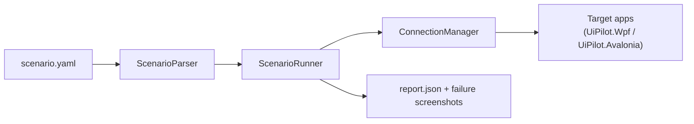

# Scenarios: user-readable UI test cases

A scenario is a small YAML file describing a sequence of steps: launch apps, interact with
elements, and assert on state. `ScenarioRunner` executes it deterministically against
`ConnectionManager` — the same lifecycle and forwarding tools an agent uses interactively — and
reports pass/fail with per-step timing, messages, and failure screenshots. No AI model is in the
execution path; the runner is a regular test harness.



## Why not have a model run the scenario?

Running steps directly through a model (e.g. via Ollama) would make results non-deterministic:
the same scenario could pass one run and fail the next for reasons unrelated to the app under
test. Instead:

- **Authoring**: paste a plain-English description ("type a name and click Greet") at
  an agent, which drafts the YAML for you to review and adjust.
- **Execution**: `ScenarioRunner` — a plain, deterministic engine — runs the same YAML every time.
- **Diagnosing a failure**: after a FAIL, feed the report (`report.json` + failure screenshot) to
  an agent to explain likely causes; it does not change the verdict.

## Writing a scenario

```yaml
name: avalonia-sample-greet

vars:
  appPath: samples/AvaloniaSampleApp/bin/Debug/net8.0/AvaloniaSampleApp.exe
  name: UiPilot

steps:
  - start_app: { path: "${appPath}", session: sample }
  - wait: { query: NameBox, session: sample, timeoutMs: 15000 }
  - type: { query: NameBox, text: "${name}", session: sample }
  - click: { query: Greet, session: sample }
  - expect_visible: { query: "Hello, ${name}", session: sample }
```

- **`name`** — used in the report and artifacts folder name; defaults to the file name.
- **`keepOpen: true`** — leave every started session running after the scenario finishes (default
  `false`: all sessions are stopped via `stop_all` when the run ends, including anything they
  spawned).
- **`foreground: true`** — start UI sessions visible and pull whichever app is being driven to the
  front as the scenario moves between sessions, so a human can watch. Default runs minimized (the
  agent/IDE stays visible; screenshots render offscreen either way). `--foreground` on the CLI turns
  it on without editing the file, and individual `start_app` steps accept `foreground` too.
- **`vars`** — a flat map of substitution values. `${name}` in any step property resolves, in
  order, from: a caller-supplied override, `vars`, then an environment variable of that name. An
  unresolved `${...}` fails at parse time (before any app is launched).
- **`steps`** — an ordered list; each item has exactly one verb key. Most verbs take a property
  map (`{ query: Login, session: oi }`); a few support a scalar shorthand (`- sleep: 500`,
  `- click: Login`).
- **`session`** — omit for the sticky active session, or set it when driving more than one app at
  once (e.g. `sim` + `oi`), exactly as you would when calling tools interactively.

## Step verbs

| Verb | Required properties | Behavior |
|---|---|---|
| `start_app` | `path` | `ConnectionManager.StartAppAsync` — launches a pilot-enabled app via `DOTNET_STARTUP_HOOKS`. Optional `session`, `workingDirectory`, `useStartupHook`, `uiFramework`, `foreground`. |
| `start_process` | `path` | `StartProcessAsync` — tracks a non-pilot process (e.g. a console host) for lifecycle only. Optional `session`, `workingDirectory`, `arguments`, `showWindow` (default `true`: own console window, visible in the taskbar). |
| `attach` | none | Attaches to an already-running pilot app. Optional `pid`, `processName`, `uiFramework`, `session`. |
| `wait_for_log` | `pathOrGlob`, `pattern` | Generic readiness wait (`LogWaiter`) — polls a file/glob for a regex match. Optional `timeoutMs` (60000), `pollMs` (200), `fromEnd`. |
| `wait` | `query` | Resolves an element via `wait_for_element`; fails the step if nothing matches within `timeoutMs` (10000). |
| `expect_visible` | `query` | Like `wait`, but the match must also be **on screen** — apps often keep both state labels in the tree and toggle visibility. |
| `expect_not_visible` | `query` | Fails if any match is still visible after `timeoutMs`. |
| `click` | `query` or `id` | Resolves (if `query`) then `click`s the element. Optional `untilVisible` (+ `untilExact`, `retryMs` = 2000) re-clicks until that state appears. |
| `type` | `query`/`id`, `text` | Resolves then `type_text`s. |
| `press_keys` | `keys` | Sends a key chord; optional `id`/`query` to focus first. |
| `select_item` | `query`/`id`, `text` or `index` | Resolves then `select_item`s. |
| `sleep` | `ms` | Plain delay; use sparingly — prefer `wait`/`wait_for_log`. |
| `screenshot` | none | Saves a named screenshot into the run's artifacts folder. Optional `session`, `name`. |
| `stop_app` | none | Stops one session (`session`, or the active one) and everything it spawned. |
| `stop_all` | none | Stops every session immediately, including spawned child processes. |

Any verb accepts `session` to target a specific named session. `click`/`type`/`select_item`/`wait`/
`expect_visible` accept an explicit `id` instead of `query` to skip re-resolving an element handle.

Any verb that takes a `query` also accepts `exact: true`, which requires the query to equal a whole
name/AutomationId/type/text instead of matching a substring. State assertions usually need it:

```yaml
- expect_visible: { query: Initialized, exact: true } # without exact, "Not Initialized" matches too
```

A command-bound button can be present and enabled while its command binding is still pending, in
which case the click is silently dropped. `untilVisible` makes the step self-correcting by
re-clicking until the expected state shows up:

```yaml
- click: { query: Initialize, exact: true, untilVisible: Initialized, untilExact: true, timeoutMs: 60000 }
```

Step messages in the report name the control that was matched and how an interaction was performed
(e.g. `Typed into SecurePasswordBox 'passwordBox' id e2 via synthetic:setpassword`), which is the
quickest way to spot a query that resolved to the wrong control.

## Running scenarios

**CLI** — runs one file or every `*.yaml`/`*.yml` in a folder, printing progress and a summary.
Exit code `0` = all passed, `1` = a scenario failed, `2` = usage/parse error (nothing was run).

```powershell
dotnet run --project src/UiPilot.Cli -- run samples/scenarios/avalonia-sample-greet.yaml
dotnet run --project src/UiPilot.Cli -- run samples/scenarios --var name=UiPilot
dotnet run --project src/UiPilot.Cli -- run samples/scenarios/avalonia-sample-greet.yaml --foreground
```

**MCP tool** — `run_scenario(path, varsJson?)`, exposed by `UiPilot.Cli` alongside the lifecycle
and forwarding tools, so an agent can trigger a scenario and read the structured report directly.

```json
{ "path": "samples/scenarios/avalonia-sample-greet.yaml", "varsJson": "{\"name\":\"UiPilot\"}" }
```

## The report

Every run writes `report.json` (and any failure screenshots) to
`%TEMP%/uipilot/runs/<name>-<timestamp>/`:

```json
{
  "name": "avalonia-sample-greet",
  "passed": false,
  "startedUtc": "2026-08-11T16:02:03Z",
  "durationMs": 8421,
  "artifactsDirectory": "C:\\Users\\me\\AppData\\Local\\Temp\\uipilot\\runs\\avalonia-sample-greet-20260811-100203",
  "steps": [
    { "index": 1, "verb": "start_app", "target": "...", "status": "Passed", "durationMs": 1203 },
    { "index": 4, "verb": "click", "target": "Greet", "status": "Failed", "durationMs": 10041,
      "message": "Step 4 (click): element 'Greet' not found within 10000 ms in session 'sample'." },
    { "index": 5, "verb": "expect_visible", "target": "Hello, UiPilot", "status": "Skipped",
      "message": "Skipped: an earlier step failed." }
  ],
  "failureScreenshots": [
    "C:\\...\\runs\\avalonia-sample-greet-20260811-100203\\failure-step4-sample.png"
  ]
}
```

Execution is **fail-fast**: the first failed step stops the remaining steps (marked `Skipped`),
one screenshot per attached pilot session is captured for evidence, and sessions are stopped
(unless `keepOpen: true`) before the report is written.

## Resilience to user activity

Interaction verbs use synthetic UI Automation invokes/patterns, not real OS input, so a scenario
keeps running correctly in the background even if you switch to another window — with one
exception: `drag` (real `SendInput` mouse events) requires the target window to stay in the
foreground for that step.

## Sample scenarios

- [samples/scenarios/avalonia-sample-greet.yaml](../samples/scenarios/avalonia-sample-greet.yaml) —
  single-app smoke test against `samples/AvaloniaSampleApp`. Product-specific multi-app scenarios
  belong in the product repo (or a private suite), not in UiPilot.
