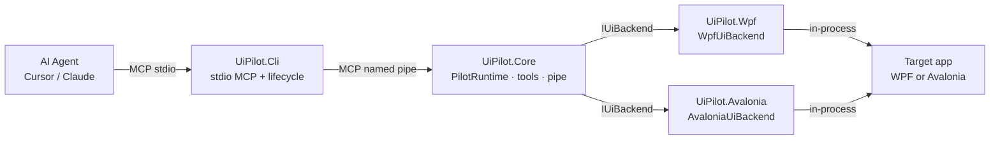
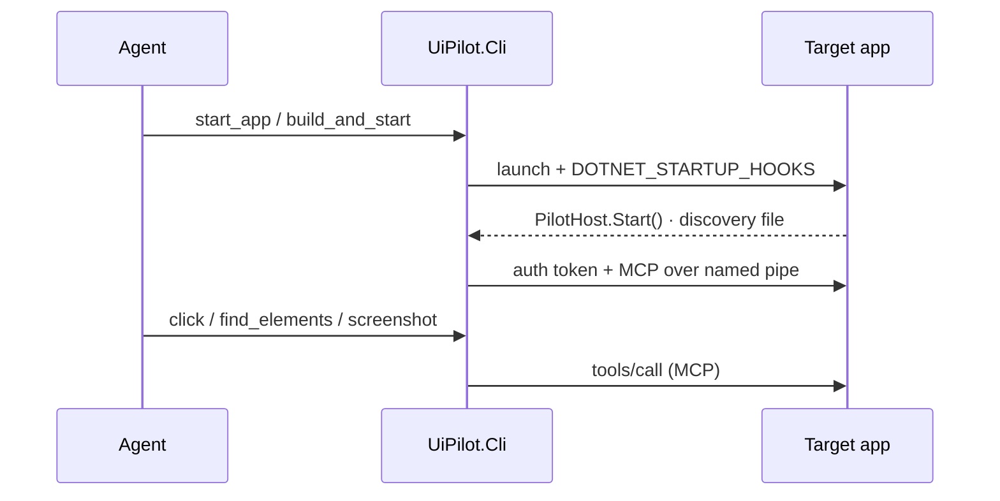

# UiPilot Design Diagram

Overview of the UiPilot design. For decisions that shaped the MVP,
see [00-design-review.md](00-design-review.md). For implementation detail, see
[02-architecture.md](02-architecture.md).

**UiPilot** — in-process desktop UI automation for AI agents: visual tree, bindings,
screenshots, and synthetic input over MCP named pipes. Few lines to adopt; the app
never launches itself.

| Pillar | Choice |
|--------|--------|
| Core approach | In-process |
| Transport | Named pipe (no TCP) |
| Tree access | Query-first (no full dumps) |
| Release safety | Debug-gated — Release `Start()` is a no-op |

## Design verdict

In-process automation is the right core. Platform-first abstractions and
multi-transport theater were deferred; MVP ships lifecycle ownership in the CLI,
security via pipe + per-run token, and a shared Core with thin adapters.

## System architecture

Agent talks stdio MCP to the CLI. CLI owns build/launch/restart and bridges tools
into the app over an authenticated named pipe. Core hosts MCP and dispatches
through `IUiBackend`.

## Packages

| Package | Role |
|---------|------|
| `UiPilot.Core` | Protocol, discovery, pipe, tools, `PilotRuntime` |
| `UiPilot.Wpf` | WPF adapter + `PilotHost.Start()` |
| `UiPilot.Avalonia` | Avalonia adapter + `PilotHost.Start()` |
| `UiPilot.StartupHook` | Generic live-UI detector for zero-edit launch |
| `UiPilot.Cli` | stdio MCP bridge + build/launch/restart + optional loopback status API |

## Agent edit loop

One session shown; multi-session is supported (`session` names).

1. **Agent** — `start_app` / `build_and_start`
2. **Cli** — launch + `DOTNET_STARTUP_HOOKS`
3. **App** — `PilotHost.Start()` · discovery file
4. **Cli** — auth token + MCP over named pipe
5. **Agent** — `click` / `find_elements` / `screenshot`

## Security defaults

| Area | Default |
|------|---------|
| **Enablement** | Runs only in Debug, with `UIPILOT_ENABLE=1`, or `Start(force: true)`. Forgotten `Start()` in Release ships nothing. |
| **Transport** | Named pipe only: `uipilot.<pid>.<guid>`. No network listener. Per-run token in `%TEMP%/uipilot`. |
| **Surface** | Query-first APIs with depth/limit. No ViewModel mutation. Custom domain tools via opt-in `[PilotTool]` only. |

## Design decisions that shaped the MVP

| Decision | Why |
|----------|-----|
| CLI owns lifecycle | App must not launch/restart itself — split in-process inspect vs out-of-process build/launch |
| Named pipe, not TCP 7777 | Avoid port collisions and remote exposure; unique pipe + discovery token per process |
| Shared Core + thin adapters | Deliberate multi-UI via `IUiBackend` — not premature REST/gRPC platform theater |
| Zero attributes for basics | Default open for Debug/automation; `[PilotTool]` reserved for custom domain tools |
| Synthetic input labeled | UIA invoke + RaiseEvent fallback; real-input/FlaUI deferred and not oversold |
| One consumer package | Apps reference `UiPilot.Wpf` or `UiPilot.Avalonia`; CLI is a separate developer tool |

## Adoption

1. Point agent at `UiPilot.Cli` MCP
2. `start_app` / `build_and_start` (hooks inject)
3. Or one-line `PilotHost.Start()`
4. Prove steps over MCP → freeze as C# tests

See [03-adoption.md](03-adoption.md), [05-tools.md](05-tools.md), [08-csharp-tests.md](08-csharp-tests.md).
